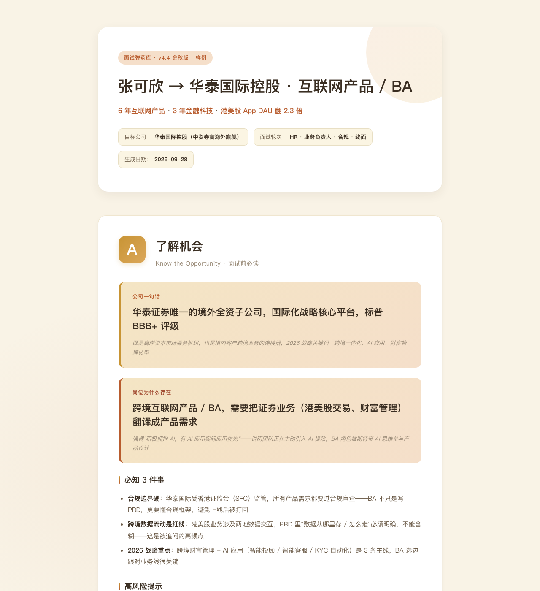

# My Skills · Caroline's AI Skills Collection

> 这里收录我做过的所有 AI Skills，按 WorkBuddy Skill 标准（SKILL.md + references/ + assets/）打包。

## 当前收录

### 1. [面试陪练（interview-coach）](./interview-coach/)

把 JD + 简历 + 公司信息结构化成 6 章面试弹药库：

- **A 了解机会** · **B 我的定位** · **C 证据 + 故事**
- **D 准备 + 深挖** · **E 适配 + 练习** · **F 最终执行**

**适用**：产品 / 运营 / 销售 / HR / 财务 / 技术 / 设计 / 法务 / 项目管理 全行业社招
**理念**：不虚构 · 不夸大 · 不写空话 · 信息不足先追问

---

## 视觉化预览

| 类型 | 链接 |
|------|------|
| 林青 → 智聘 AI 样例（虚构 PM 案例）| [./面试陪练-样例输出-v4.4.html](./面试陪练-样例输出-v4.4.html) |
| 张可欣 → 华泰国际 样例（虚构 BA 案例）| [./面试陪练-样例-张可欣-华泰国际.html](./面试陪练-样例-张可欣-华泰国际.html) |
| 华泰国际样例首屏截图 |  |

---

## 路线图（Roadmap）

- [ ] HR 简历润色
- [ ] Offer 谈判岗位
- [ ] 离职交接文档
- [ ] 团队管理助手
- [ ] 客户拜访纪要
- [ ] 客户提案生成

---

## 贡献新 Skill

新 skill 按以下结构新建子目录：

```
your-skill-name/
├── SKILL.md            # 主入口（含 YAML frontmatter）
├── references/         # 工作流文档
└── assets/             # 模板与素材
```

每个 SKILL.md 顶部需包含：

```yaml
---
name: your-skill-name
description: 一句话讲清楚这个 skill 是干什么的、解决什么问题。
allowed-tools: [WebSearch, WebFetch]   # 按需声明
---
```

---

## 维护指南

```bash
# 拉取最新
git pull

# 提交更新
git add -A
git commit -m "更新说明"
git push
```

---

## License

MIT